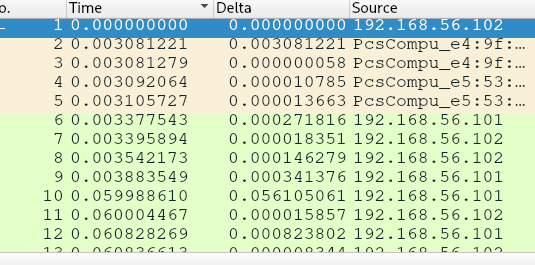

<html>
<head>
</head>
</html>

## Tabela de conteúdos
1. [Wireshark profiles](#wireshark-profiles)
    1. [Coluna time e o tempo](#coluna-time-e-o-tempo)
    2. [Adicionar nova coluna tempo](#adicionar-nova-coluna-tempo)
    3. [Adicionar colunas através de campos nos protocolos](#adicionar-colunas-através-de-campos-nos-protocolos)
    4. [Ativar e desativar colunas](#ativar-e-desativar-colunas)
    5. [Cores no tráfego](#cores-no-tráfego)
    6. [Layout do Wireshark](#layout-do-wireshark)

---

## Wireshark profiles

Os perfis são configurações que se pode fazer no wireshark pra melhor visibilidade do que está sendo analisado. Seja mudar a posição dos blocos apresentados como especificar cores específicas para determinadas situações, assim sendo mais fácil de visualizar aquilo ocorrendo no sniffer.

Para criar, deve-ser clicar com o botão direito em profiles (canto inferior direito) e em new...

Uma primeira mudança interessante pode ser o zoom. Aumentando um pouco pode facilitar a leitura dos pacotes.

### Coluna Time e o tempo

A coluna “time” no wireshark está marcando o tempo de chegada dos pacotes a partir do momento que o primeiro pacote foi capturado. Sendo assim, o primeira começa em 0.000... e a partir do segundo, o tempo é sempre em relação à esse primeiro pacote.

É possível mudar para que o tempo agora seja em relação ao pacote anterior, e não ao primeiro. Assim é possível analisar problemas de delay, quando um pacote demorou muito pra aparecer.

Para isso, vamos em View, nas opções no menu superior do wireshark. Após isso, acharemos “Time Display Format” e escolheremos “Seconds since previous displayed packet”. - Assim, 3 segundos não significa que aquele pacote apareceu 3 segundos após o primeiro, e sim 3 segundos após o anterior.

Como a ideia é adicionar um nova coluna que faz isso, iremos manter na marcação de tempo em relação ao inicio da captura.

### Adicionar nova coluna tempo

Para adicionar uma nova coluna, abriremos as preferências e clicaremos no + dentro da aba de colunas.

Modificamos o nome e escolheremos o tipo “delta time”.

Após isso, arrastaremos a linha para abaixo da “time”, assim as colunas ficarão uma do lado da outra.

Na imagem é possível ver como ficou organizado o sniffer.

A coluna time indicando o tempo em relação à primeira captura, já a coluna Delta indicando o tempo em relação à captura anterior.

Obs: sempre que configurar o tempo através do menu “View”, a coluna Time é a que será afetada.

### Adicionar coluna através de campos nos protocolos

É interessante adicionar uma coluna sempre que um determinado campo for constatemente analisado, assim não é necessário ir abrindo todos os pacotes pra vê-lo.

Para adicionar, por exemplo, o TTL como uma coluna, abriremos um pacote, clicaremos com botão direito no campo e em “apply to column”.

Também é possível clicar na coluna e em editar coluna. Assim mudaremos de Time to Live para TTL, assim podemos diminuir o espaço ocupado pela coluna e ainda entender qual o nome da mesma.

### Ativar e desativar colunas

Ao clicar no head com o botão direito - a faixa cinza onde estão todas as colunas - é possível desativar e ativar colunas facilmente. Também é possível realizar edições nas colunas.

### Cores no tráfego

Para colorir um determinado filtro no wireshark, vamos em “View” e “Coloring Rules”. Alí podemos editar as regras existentes ou adicionar uma nova.

Adicionamos a cor verde ao filtro tcp.flags.syn==1. Dessa forma, sempre que houver um TCP com flag SYN setada, ele será verde. 

**OBS: Por que movi para a segunda posição, abaixo de Bad TCP? Isso foi feito pois essa lista segue uma ordem de prioridades, ao fazer isso estou indicando que a prioridade na cor será de Bad TCP. Sendo assim, caso ocorra um TCP retransmission, ele não será verde (caso o filtro que criei estivesse acima dele) mas sim da cor criada para Bad TCP. Outro detalhe seguindo essa lógica da prioridade, é que mais embaixo já existe um filtro para TCP SYN, com a cor cinza, mas como o criado por mim está acima, ele será verde.**

### Ajustando o layout do wireshark

Na aba de preferências é possível modificar o layout do wireshark.

O padrão é o primeiro, em formato de escada.

É interessante também utilizar a segunda opção.

Também é possível modificar o que está dentro de cada painel, logo abaixo das figuras.
