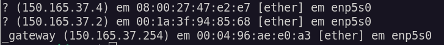
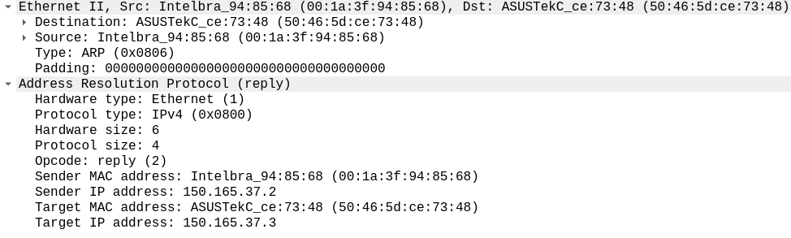
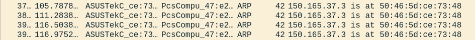

# Tabela de conteúdos
1. [ARP](#arp)
    1. [Cabeçalho ARP](#11-cabeçalho-arp)
    2. [ARP request e Scapy](#12-arp-request-e-scapy)
    3. [ARP reply e Scapy](#13-arp-reply-e-scapy)
2. [Referências](#referências)

---

# Observações iniciais
```python
Textos dentro desses blocos são códigos em python
```
<div style='background-color: #eaeaea; color: black'>
    <pre>  Textos dentro desses blocos são a saída da execução do código acima</pre>
</div>

# 1. ARP
> Definido pela RFC 826

O protocolo arp tem objetivo de descobrir qual endereço MAC está associado a determinado IPv4 na rede. 
Para que duas máquinas em uma rede Ethernet se comuniquem, é necessário que o host que enviará os pacotes conheça o endereço MAC de destino. 

<p>Um host "A" deseja acessar um servidor Web "B" na mesma rede. Para que isso aconteça, o primeiro host envia um pacote com destino broadcast para a Ethernet perguntando qual host possui o endereço ip de B. Quando o pacote chegar em B, ele responderá com o seu endereço MAC. Os outros hosts descartarão o pacote, pois não são o alvo da requisição.</p>
<p>Quando o host A receber a resposta, a sua tabela ARP de endereços é atualizada. Sendo assim, para uma futura comunicação entre os dois hosts, não será necessário utilizar o ARP novamente, pois o endereço MAC de B agora estará associado ao seu endereço IP</p>

> Exemplo de uma tabela ARP antes de realizar um ping para 150.165.37.4. 


> Exemplo da tabela ARP após realizar o ping para 150.165.37.4. 


Note que uma entrada foi adicionada - a associação entre os endereços IP e MAC do host alvo.
Para acessar a tabela arp, na maioria das distribuições linux e windows, utilize o comando "arp -a".

## 1.1. Cabeçalho ARP


## 1.2. ARP request e Scapy
O ARP request é feito pelo host que deseja enviar o pacote na rede, e para isso, precisa descobrir o MAC alvo.
O destino (broadcast) é levado no cabeçalho Ethernet, já o "alvo" do request - o endereço IP de quem queremos descobrir o MAC - está no cabeçalho do ARP. Todos os hosts na rede receberão o pacote, visto que o destino é broadcast. O alvo do ARP request enviará um ARP reply para o host de origem, e os outros hosts descartarão o pacote.

Na imagem abaixo, é possível ver através do wireshark como acontece quando um ARP request é feito.


Alguns pontos importantes para criação de um pacote ARP request foram destacados.
* Seta azul (primeira): É o destino broadcast, definido pelo Ethernet. 
* Seta vermelha (segunda): É o endereço MAC do alvo. O ARP request é feito exatamente para consegui-lo, sendo assim, ao enviar o pacote, não temos o valor do endereço físico.
* Seta verde (terceira): É o endereço IP do alvo. Ele é necessário para indicar que queremos o endereço MAC daquele host.

### Importando scapy

Utilizando o scapy, é possível manipular um pacote ARP através de seus campos. Assim, é fácil de visualizar como ocorre na prática. No exemplo abaixo, note que todas as funções do scapy foram importadas, mas é interessante importar somente as que serão utilizadas quando estiver criando um script.


```python
from scapy.all import *
conf.verb=1
conf.color_theme = RastaTheme()
```

### Criando e encapsulando


```python
ether = Ether(dst="ff:ff:ff:ff:ff:ff")
ether.show()
```
<div style='background-color: #eaeaea; color: black'>  
    <pre>
    ###[ ARP ]###
  hwtype    = 0x1
  ptype     = IPv4
  hwlen     = None
  plen      = None
  op        = who-has
  hwsrc     = 50:46:5d:ce:73:48
  psrc      = 150.165.37.3
  hwdst     = 00:00:00:00:00:00
  pdst      = 0.0.0.0
    </pre>
  </div>

```python
arp = ARP()
arp.show()
```

 <div style='background-color: #eaeaea; color: black'>  
    <pre> 
   ###[ ARP ]### 
  hwtype    = 0x1
  ptype     = IPv4
  hwlen     = None
  plen      = None
  op        = who-has
  hwsrc     = 50:46:5d:ce:73:48
  psrc      = 150.165.37.3
  hwdst     = 00:00:00:00:00:00
  pdst      = 0.0.0.0    
    </pre>
    </div>

Para que o pacote forjado funcione como ARP request, é necessário definir o endereço IP alvo, como será feito a seguir. Note que o cabeçalho arp foi atualizado com o novo IP.


```python
arp.pdst = "150.165.37.4"
arp.show()
```
<div style='background-color: #eaeaea; color: black'>  
    <pre>
    ###[ ARP ]### 
  hwtype    = 0x1
  ptype     = IPv4
  hwlen     = None
  plen      = None
  op        = who-has
  hwsrc     = 50:46:5d:ce:73:48
  psrc      = 150.165.37.3
  hwdst     = 00:00:00:00:00:00
  pdst      = 150.165.37.4
 </pre>
    </div>

O encapsulamento com scapy é facilmente definido ao utilizar "/". Também é possível visualizar o pacote como um todo, ao utilizar a função "show()" no pacote encapsulado.


```python
pacote = ether/arp
pacote.show()
```

 <div style='background-color: #eaeaea; color: black'>  
    <pre>
###[ Ethernet ]### 
  dst       = ff:ff:ff:ff:ff:ff
  src       = 50:46:5d:ce:73:48
  type      = ARP
###[ ARP ]### 
     hwtype    = 0x1
     ptype     = IPv4
     hwlen     = None
     plen      = None
     op        = who-has
     hwsrc     = 50:46:5d:ce:73:48
     psrc      = 150.165.37.3
     hwdst     = 00:00:00:00:00:00
     pdst      = 150.165.37.4
     </pre>
</div>


### Enviando o pacote e recebendo a resposta


Existem algumas formas de enviar um pacote utilizando o scapy
- sendp(): Envia um pacote que começou na segunda camada (quando se cria o pacote manualmente)
- send(): Envia um pacote que começou na terceira camada (quando se cria o pacote manualmente)
- srp(): Envia um pacote e espera a sua resposta, mesmo princípio do sendp() em relação a camada
- sr(): Envia um pacote e espera sua resposta, mesmo princípio do send() em relação a camada
>Estaremos utilizando srp(), visto que nosso pacote consiste em Ether()/ARP()


```python
resposta, semresposta = srp(pacote)
resposta.show()
```

<div style='background-color: #eaeaea; color: black'>  
<pre style="white-space: pre-wrap">
    Begin emission:
    Finished sending 1 packets.
    
    Received 1 packets, got 1 answers, remaining 0 packets
    0000 Ether / ARP who has 150.165.37.4 says 150.165.37.3 
    ==> Ether / ARP is at 08:00:27:47:e2:e7 says 150.165.37.4 / Padding
</pre>
</div>

De um lado temos o arp request (forjado através do scapy) e do outro a resposta recebida. 
O pacote enviado também foi capturado pelo wireshark, abaixo é possível visualizar através dele.


## 1.3. ARP reply e Scapy

O ARP reply é a reposta de um host B ao receber o request do host A. É o momento em que é enviado o endereço MAC para quem o solicitou primeiramente.
Observando um ARP reply pelo wireshark, é possível perceber algumas diferenças nos campos do protocolo, em relação ao request. 
- Primeiramente, o endereço de destino (ethernet), não será mais broadcast, visto que a máquina que recebeu o request sabe de onde veio.
- Não há campos vazios.
- O código de operação agora é 2 (reply)



### Gratuitous ARP reply e Scapy

Quando se envia um ARP reply sem a existência de um ARP request anterior, trata-se de um gratuitous ARP reply.
O ARP reply gratuito pode ser usado para atualizar tabelas com MAC quando acontece uma mudança. No caso do ARP poisoning, será utilizado para atualizar o cache ARP com informações falsas.

Para forjar um ARP reply através do Scapy, precisamos saber o endereço IP e MAC de destino. 

Note que os endereços IP e MAC de origem do Scapy são o da própria máquina, sendo assim, ao enviar um ARP reply sem alterá-los, estamos "respondendo" o host alvo com nosso endereço MAC. Caso a tabela ARP do host alvo já tenha nosso endereço IP associado ao MAC, simplesmente será atualizado. Caso não tenha, será adicionado.

> No exemplo abaixo, capturado pelo wireshark, foram realizados 4 ARP replies sem request prévio (utilizando o Scapy). Além disso, os valores padrão não foram alterados, então o reply simplesmente atualiza o cache da máquina alvo com valores reais.

>Note que será feito de uma forma direta, sem atribuir os valores à variáveis como feito anteriormente.


```python
sendp(Ether()/ARP(pdst="150.165.37.4", hwdst="08:00:27:47:e2:e7", op=2), count=4)
```

 <div style='background-color: #eaeaea; color: black'>  
    <pre>
    Sent 4 packets.
    </pre>
  </div>



> No próximo exemplo, será forjado um ARP reply com valores falsos com o Scapy. Note que passo o endereço IP de outra máquina como origem. Além disso, o endereço MAC passado não existe.


```python
sendp(Ether()/ARP(pdst="150.165.37.4", hwdst="08:00:27:47:e2:e7", psrc="150.165.37.9", hwsrc="50:46:50:45:50:46", op=2), count=4)
```

<div style='background-color: #eaeaea; color: black'>  
    <pre>
    Sent 4 packets.
    </pre>
 </div>


> Note que o host alvo não conseguirá se comunicar com o endereço 150.165.37.9, visto que o MAC adicionado à sua tabela ARP não existe. Eventualmente, uma nova consulta será feita por parte do host alvo e o cache será atualizado com valores reais.

# 2. Referências

OBS: Organizar referências:
- Análise de tráfego em redes TCP/IP - João Eriberto Mota Filho
- Redes de computadores - Tanenbaum / Wetheral
- Documentação Scapy - https://scapy.readthedocs.io/en/latest/
- RFC 826 
- ...
