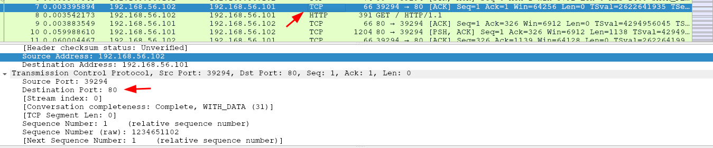
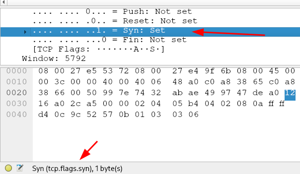
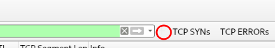
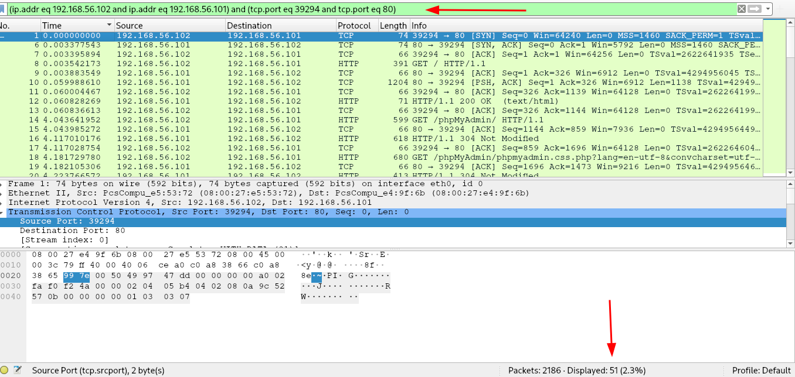
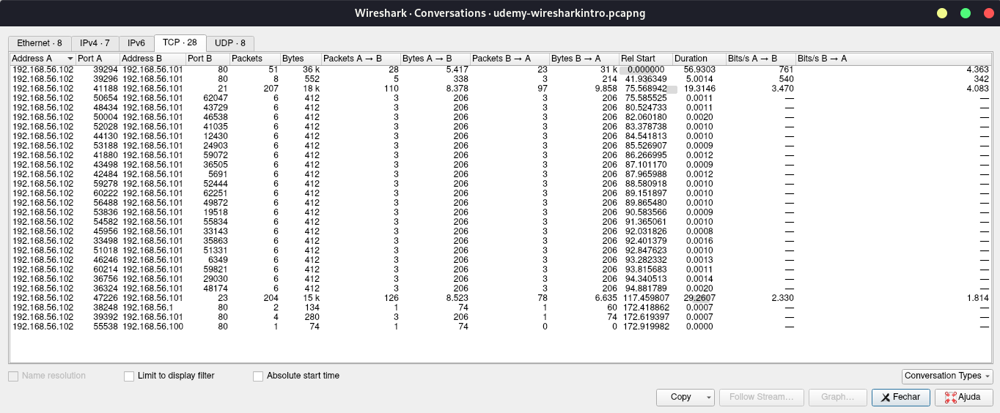
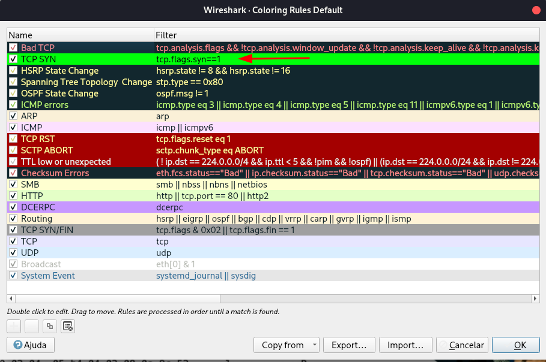
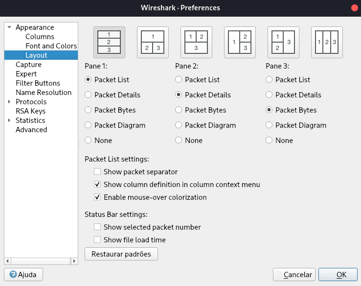

<html>
<head>
     <link rel="stylesheet" href="css.css">
</head>
</html>

# Wireshark

## Tabela de conteúdos
1. [Observações iniciais](#observações-iniciais)
2. [Capturando de forma intermitente](#capturando-de-forma-intermitente)
3. [Filtros](#filtros)
    1. [Display filters vs Capture filters](#display-filters-vs-capture-filters)
    2. [Filtrando por IP](#filtrando-por-ip)
    3. [Filtrando por protocolos](#filtrando-por-protocolos)
    4. [Filtros como botões](#filtros-como-botões)
    5. [TCP analysis](#tcp-analysis)
    6. [Conversation filters](#conversation-filters)
    7. [Preparar e aplicar filtros](#preparar-e-aplicar-filtros)
    8. [Operadores e combinação de filtros](#operadores-e-combinação-de-filtros)
    9. [Filtros especiais](#filtros-especiais)
    10. [Reduzindo e exportando um pcap com filtros](#reduzindo-e-exportando-um-pcap-com-filtros)
2. [Wireshark profiles](#wireshark-profiles)
    1. [Coluna time e o tempo](#coluna-time-e-o-tempo)
    2. [Adicionar nova coluna tempo](#adicionar-nova-coluna-tempo)
    3. [Adicionar colunas através de campos nos protocolos](##adicionar-colunas-através-de-campos-nos-protocolos)
    4. [Ativar e desativar colunas](#ativar-e-desativar-colunas)
    5. [Cores no tráfego](#cores-no-tráfego)
    6. [Layout do Wireshark](#layout-do-wireshark)

---

## Observações iniciais

O wireshark sempre nos dirá o protocolo da camada mais alta na coluna “protocol”.

No exemplo acima, o protocolo que aparece é TCP, mesmo que a porta de destino seja a porta 80 (normalmente, http). Isso também acontece no caso da porta de origem sendo 80.

Nesse caso, isso acontece pois houve a comunicação TCP com a porta 80 mas nenhum payload HTTP foi enviado. Ou seja, ao filtrar por tcp, nós conseguimos ver tudo que aconteceu naquela porta através de tcp, desde o início da comunicação (vemos o handshake) até outros pacotes tcp que não contém payload http.

Pode ser interessante filtrar não pelo http, vendo os pacotes que contém payload, mas sim pela porta tcp 80 (ou outra que esteja segurando o servidor http). Isso pois pode ser importante visualizar o que está ocorrendo camada que sustenta aquela aplicação.

## Capturando de forma intermitente

Para isso, vamos acessar as opções de captura, no momento antes de escolher a interface.

## Filtros

Detalhe importante, sempre que vc clicar em um campo dentro de um pacote, no canto inferior esquerdo, o wireshark irá dizer como vc pode filtrar a partir daquele campo.

No exemplo acima, ao clicar na flag tcp SYN, podemos visualizar no canto inferior esquerdo que podemos utilizar “tcp.flags.syn” para filtrar no Display filter.

Note que o “1” seria equivalente ao set, então para filtrar somente pacotes TCPs com onde o SYN ocorreu, faremos da seguinte forma: tcp.flags.syn==1.

### Display filters vs Capture filters

Os display filters são filtros que são aplicados após os pacotes terem sido capturados, ou seja, vc pode modificar como e quanto quiser. É possível adicionar um filtro, remover, adicionar novamente, retirar todos os filtros... e ainda assim a captura estará lá, completa. Os display filters simplesmente estão filtrando o que vai aparecer no wireshark, mas as capturas foram feitas e é possível analisar sem filtro caso queira.

Os capture filters são aplicados antes de começar a capturar pacotes, ao escolher a interface de rede. Ao definir um capture filter, só serão capturados pacotes que seguem aquele filtro definido. O padrão é capturar tudo.

Uma boa prática, de começo, é capturar tudo (não definir capture filter) e modificar somente os display filters.

**Os filtros mostrados daqui em diante serão display filters.**

### Filtrando por IP

- ip.addr==192.168.1.2 - pacotes com endereço IP de origem OU destino 192.168.1.2
- ip.src==192.168.1.2 - pacotes com endereço IP de ORIGEM 192.168.1.2
- ip.dst==192.168.1.2 - pacotes com endereço IP de DESTINO 192.168.1.2
- ip.addr=192.168.1.0/24 - pacotes de origem ou destino saíndo ou chegando naquela rede.

Utilizando o CIDR (por exemplo, /24) é possível também filtrar por somente origem ou destino.

<aside>
💡 A aba de “Endpoint” dentro de “Statistics” permite visualizar os hosts que participaram da comunicação até aquele momento. Lembrando que é possível marcar a caixa no canto inferior para limitar os endpoints mostrados ao que foi filtrado somente.

</aside>

### Filtrando por protocolo

Para filtrar diretamente por protocolo é bem simples, simplesmente digitar qual protocolo quer dentro do input do Display filter.

Exemplos: arp, ip, udp, etc...

<aside>
💡 Podemos acessar alguns filtros exemplos ao acessar a aba “Display filters” dentro de “Analyze”.

</aside>

### Filtros como botões

Logo ao lado da Display filter, onde vc pode digitar um filtro manualmente, há um + onde se pode adicionar um filtro como botão. Isso permite que só seja necessário clicar no botão para aplicar o filtro. 

Note na imagem que os botões “TCP SYNs” e “TCP ERRORs” foram criados para facilitar caso queira filtrar por esses parâmetros.

O círculo vermelho marca o “+”, onde é possível adicionar novos botões. Nesse caso, é difícil ver o botão pois está da mesma cor que o fundo do wireshark.

<aside>
💡 Ao criar um filtro com nome que contém //, vc estará criando um menu dropdown. Por exemplo: TCP//Reset, criará um botão TCP que contém Reset dentro.

</aside>

### TCP analysis

Essas flags não são do TCP em si, mas sim do wireshark. Ao filtrar o tcp.analysis.flags, é possível encontrar atividade suspeita que pode ser analisada. Não significa que sempre será algo suspeito, mas vale ficar de olho.

### Conversation filters

Ao clicar com o botão direito em um dos pacotes, é possível acessar a aba “conversation filters”, isso permite filtrar somente os pacotes que fazem parte daquela comunicação. Ao fazer isso, não vou estar filtrando somente, por exemplo, TCP, mas também para que só seja mostrado os pacotes TCP daquela comunicação entre as duas portas.

Note que ao aplicar o conversation filter, de 2186 pacotes, só aparecem 51. Também é possível perceber que o filtro aplicado não é somente “tcp”, mas algo mais complexo que permite filtrar ainda mais. O conversation filter especifíca, por exemplo, que o que deve aparece na tela são os pacotes entre 2 determinados IPs e 2 determinadas portas.

É possível analisar quais foram as “conversations” que aconteceram durante a análise. É possível acessar na aba “conversations” dentro de “statistics”.

Exemplo: conexões TCP dentro da captura de pacotes que aconteceu.

<aside>
💡 É possível aplicar um conversation filter através dessa janela clicando com o botão direito na comunicação e em “apply filter”.

</aside>

### Preparar e aplicar filtros

É possível aplicar filtros ao clicar com botão direito em um campo do pacote e clicar em apply filter. Ainda assim, é possível fazer o mesmo com prepare filter.

A diferença é que o prepare filter simplesmente cria o filtro e deixar dentro do input display filter, no topo do wireshark (ele não aplica). Assim é possível modificar como quiser antes de aplicar.

O apply filter adiciona ao input do display e automaticamente aplica. Sendo assim, é possível editá-lo normalmente mas ele ja terá sido aplicado.

### Operadores para combinar filtros

É possível combinar filtros utilizando os seguintes operadores ja conhecidos:

- “==“ ou “eq”
- “!” ou “not”
- “||” ou “or”
- “&&” ou “and”
- “>” ou “gt”
- “<” ou “lt” - (LT em minúsculo)

Exemplo: ip.addr eq 192.168.1.1 && tcp

Mostra todas os pacotes tcp, entrando ou saíndo do endereço IP 192.168.1.1

Exemplos com contexto:

Alguns protocolos foram analisados e “arp” parece “saudável”. Sendo assim, vc quer excluir arp de ser mostrado através da filtragem.

Isso seria feito da seguinte forma:

!arp

Também poderia ser feito com mais de um, exemplo:

!(arp or stp)

Outro exemplo seria não mostrar os pacotes com destino Broadcast:

eth.dst == ff:ff:ff:ff:ff:ff 

(eth = ethernet)

<aside>
💡 Também é possível aplicar um campo do protocolo como filtro, clicando com botão direito e “apply as filter”.

</aside>

### Filtros especiais

- contains (string exata) - ex: frame contains google
- matches (regex) - ex: [http.host](http://http.host) matches “\.(org|com|net)”
- in {range} - ex: tcp.port in {80 443 8000}

obs: contains compara a string exatamente como foi escrita, o matches não considera se alguma letra é maiúscula ou minúscula.

Mais alguns exemplos com matches ou contains:

Ex: frame matches admin 

note que o contains poderia substituir o matches, mas palavras “admin” com alguma letra maiúscula não apareceriam.

Ex2: frame contains GET

### Reduzindo e exportando um pcap com filtros

Também podemos reduzir o tamanho do pcap (Arquivo wireshark) sendo analisado. Para isso, definimos um display filter e após isso vamos em “export specified packets” dentro da aba “File”. Além disso, é possível especificar um “range” de pacotes para serem exportados dentro da própria janela de exportação.

---

## Wireshark profiles

Os perfis são configurações que se pode fazer no wireshark pra melhor visibilidade do que está sendo analisado. Seja mudar a posição dos blocos apresentados como especificar cores específicas para determinadas situações, assim sendo mais fácil de visualizar aquilo ocorrendo no sniffer.

Para criar, deve-ser clicar com o botão direito em profiles (canto inferior direito) e em new...

Uma primeira mudança interessante pode ser o zoom. Aumentando um pouco pode facilitar a leitura dos pacotes.

### Coluna Time e o tempo

A coluna “time” no wireshark está marcando o tempo de chegada dos pacotes a partir do momento que o primeiro pacote foi capturado. Sendo assim, o primeira começa em 0.000... e a partir do segundo, o tempo é sempre em relação à esse primeiro pacote.

É possível mudar para que o tempo agora seja em relação ao pacote anterior, e não ao primeiro. Assim é possível analisar problemas de delay, quando um pacote demorou muito pra aparecer.

Para isso, vamos em View, nas opções no menu superior do wireshark. Após isso, acharemos “Time Display Format” e escolheremos “Seconds since previous displayed packet”. - Assim, 3 segundos não significa que aquele pacote apareceu 3 segundos após o primeiro, e sim 3 segundos após o anterior.

Como a ideia é adicionar um nova coluna que faz isso, iremos manter na marcação de tempo em relação ao inicio da captura.

### Adicionar nova coluna tempo

Para adicionar uma nova coluna, abriremos as preferências e clicaremos no + dentro da aba de colunas.

Modificamos o nome e escolheremos o tipo “delta time”.

Após isso, arrastaremos a linha para abaixo da “time”, assim as colunas ficarão uma do lado da outra.

Na imagem é possível ver como ficou organizado o sniffer.

A coluna time indicando o tempo em relação à primeira captura, já a coluna Delta indicando o tempo em relação à captura anterior.

Obs: sempre que configurar o tempo através do menu “View”, a coluna Time é a que será afetada.

### Adicionar coluna através de campos nos protocolos

É interessante adicionar uma coluna sempre que um determinado campo for constatemente analisado, assim não é necessário ir abrindo todos os pacotes pra vê-lo.

Para adicionar, por exemplo, o TTL como uma coluna, abriremos um pacote, clicaremos com botão direito no campo e em “apply to column”.

Também é possível clicar na coluna e em editar coluna. Assim mudaremos de Time to Live para TTL, assim podemos diminuir o espaço ocupado pela coluna e ainda entender qual o nome da mesma.

### Ativar e desativar colunas

Ao clicar no head com o botão direito - a faixa cinza onde estão todas as colunas - é possível desativar e ativar colunas facilmente. Também é possível realizar edições nas colunas.

### Cores no tráfego

Para colorir um determinado filtro no wireshark, vamos em “View” e “Coloring Rules”. Alí podemos editar as regras existentes ou adicionar uma nova.

Adicionamos a cor verde ao filtro tcp.flags.syn==1. Dessa forma, sempre que houver um TCP com flag SYN setada, ele será verde. 

**OBS: Por que movi para a segunda posição, abaixo de Bad TCP? Isso foi feito pois essa lista segue uma ordem de prioridades, ao fazer isso estou indicando que a prioridade na cor será de Bad TCP. Sendo assim, caso ocorra um TCP retransmission, ele não será verde (caso o filtro que criei estivesse acima dele) mas sim da cor criada para Bad TCP. Outro detalhe seguindo essa lógica da prioridade, é que mais embaixo já existe um filtro para TCP SYN, com a cor cinza, mas como o criado por mim está acima, ele será verde.**

### Ajustando o layout do wireshark

Na aba de preferências é possível modificar o layout do wireshark.

O padrão é o primeiro, em formato de escada.

É interessante também utilizar a segunda opção.

Também é possível modificar o que está dentro de cada painel, logo abaixo das figuras.
